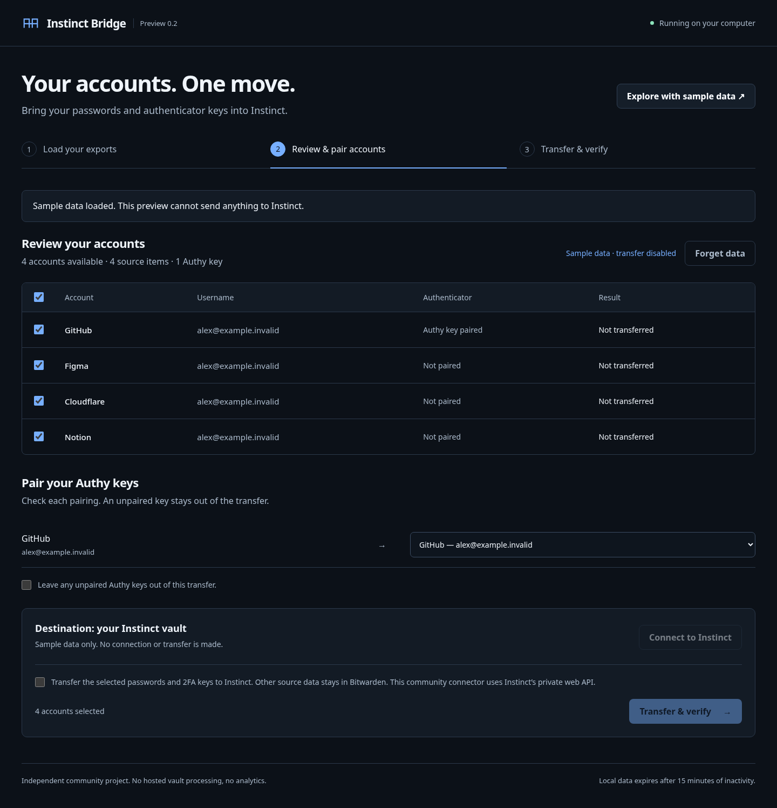

# Instinct Bridge

A local app to move Bitwarden logins and recoverable Authy 2FA keys into Instinct, with account selection, explicit pairing, and verification after transfer.

**Preview 0.2.** Tested against a real Instinct vault using synthetic credentials. This is a login/TOTP bridge, not a complete-vault migration tool. **Extraction from an actual Authy iPhone remains unvalidated.** Independent of Instinct, Bitwarden, and Twilio.



## Run locally

Verified on CachyOS/Linux with Python 3.14 and Brave. Other platforms are not yet verified.

```bash
python3 -m venv .venv
.venv/bin/pip install -e .
.venv/bin/instinct-bridge-ui
```

Open the private link printed in the terminal. The app binds to `127.0.0.1`; it does not open or focus a browser automatically. Keep the terminal open. Sign in to [Instinct](https://app.instinct.com/vault) in your regular Brave profile before connecting.

1. Select a Bitwarden JSON export. Portable password-protected exports support PBKDF2 and Argon2id; account-restricted backups are rejected. Enter the **export password**, which stays local.
2. Optionally load a captured Authy token JSON and enter its backup password. See the [iPhone guide](docs/authy-iphone.md) for the separate extraction step.
3. Review the selected accounts and Authy pairings. Unsupported fields are reported and stay in Bitwarden.
4. Connect to Instinct, confirm the scope, and transfer. The bridge reads each stored credential back to verify it.
5. Use **Forget data**, then stop the server with Ctrl+C.

“Explore with sample data” runs a preview that cannot connect to or write to a real vault.

## Supported scope

| Input | Supported today | Limits |
| --- | --- | --- |
| Bitwarden JSON | Names, usernames, passwords, embedded TOTP | UI explicitly offers credential-only transfer when other fields exist; strict CLI withholds such items |
| Password-protected Bitwarden JSON | PBKDF2-SHA256 and Argon2id decryption, authenticated AES-CBC | Bounded KDF workload; account-restricted export unsupported |
| Authy token JSON | Local encrypted backup decryption; explicit login pairing | Captured/exported token file required; no automatic iPhone extraction |
| TOTP | SHA1, 6 digits, 30 seconds | Other algorithms/configurations are withheld |
| Other vault content | Reported for review | Notes, URLs, cards, attachments, passkeys and organization metadata are not migrated |

Existing identical entries are verified and skipped. Different entries with the same name are left unchanged, including an existing login to which you are trying to add a new 2FA key. Import passwords and Authy together for automatic pairing. Duplicate source names require explicit resolution.

## Privacy and transfer behavior

Exports are unlocked in local process memory. No analytics, hosted import service, remote assets, or plaintext intermediate exports. Passwords and OTP seeds are excluded from preview responses and logs. Source files are never deleted. Loaded server data expires after 15 minutes of inactivity; managed memory is not securely erased.

The connector reads the Instinct session from Brave and uses a **separate headless browser**. It relies on operations observed in Instinct's own web application, **not a stable public API**. Selected credentials go directly over HTTPS to Instinct, which receives their plaintext values. This does not extend Bitwarden's end-to-end encryption guarantees to Instinct.

Run one importer at a time without concurrent destination edits: the observed upsert API has no verified conditional-create operation. A failed or uncertain write stops the batch; it is never automatically retried. See [security requirements and limitations](SECURITY.md).

## CLI and verification

```bash
# Local preview, without reading a browser session.
.venv/bin/instinct-bridge tests/fixtures/bitwarden-synthetic.json

# Encrypted preview; prompts privately, never takes a password argument.
.venv/bin/instinct-bridge path/to/export.json --encrypted

# Explicit strict transfer, only if all source items are supported.
.venv/bin/instinct-bridge path/to/export.json --encrypted \
  --apply --brave-session --accept-unofficial-connector

.venv/bin/python -m unittest discover -s tests -v

# Optional: creates and cleans up its own synthetic record in your real vault.
.venv/bin/python scripts/verify_e2e.py --brave-session
```

The graphical interface provides Authy pairing and account selection. The CLI currently imports Bitwarden only.

[Live connector evidence](docs/evidence/2026-09-24-e2e.json) and [browser + encrypted-source evidence](docs/evidence/2026-09-24-ui-e2e.json) record exact checks. Synthetic encrypted fixtures are generated independently with Node/OpenSSL (`scripts/generate_fixtures.mjs`); their public password is `SYNTHETIC-export-password`. TOTP is checked against RFC 6238 vectors. These checks do not prove a login to every external service or extraction from an iPhone.

## Community release

MIT licensed. Please use synthetic accounts in contributions and bug reports. The current preview needs a real-device Authy extraction test and independent security review before claiming broad migration support.

- [Contributing](CONTRIBUTING.md)
- [Research and source references](docs/research.md)
- [Implementation plan](docs/product-plan.md)
- [Release checklist](docs/release-checklist.md)
