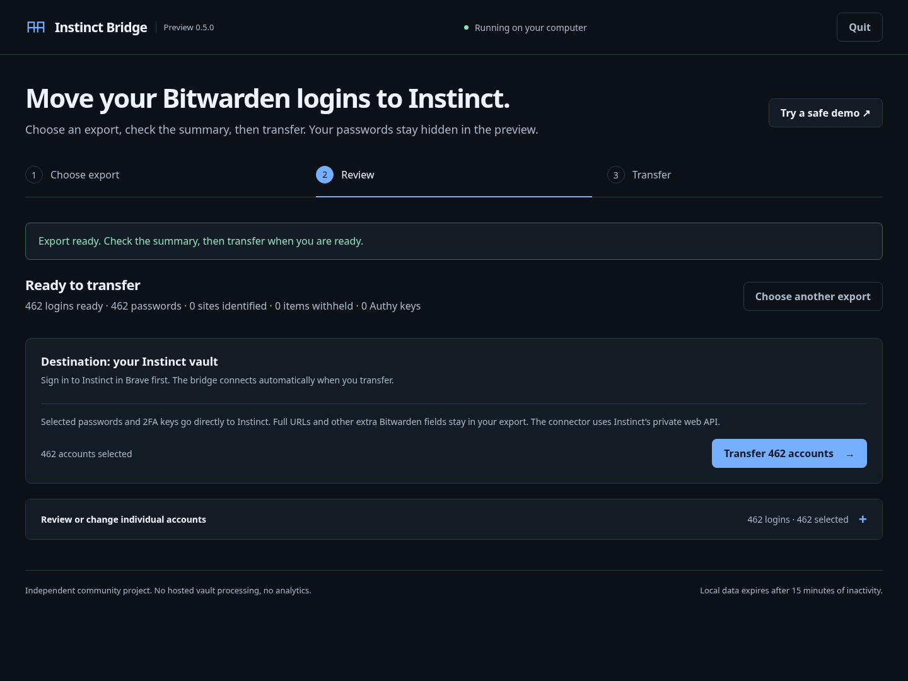

# Instinct Bridge

Move Bitwarden logins to Instinct with a local app. Review your accounts before transferring, then verify what Instinct saved.

**Preview 0.6.0: Linux x86_64 + Brave.** [Download the app](https://github.com/kabylesystem/instinct-bridge/releases/download/v0.6.0/InstinctBridge-linux-x86_64.tar.gz). This build is unsigned; [release notes and checksums](https://github.com/kabylesystem/instinct-bridge/releases/tag/v0.6.0) are available.

Windows, macOS and other browsers have not been tested. The app is independent of Bitwarden, Instinct and Twilio.

## Get started

1. Sign in to [Instinct](https://app.instinct.com/vault) in your regular Brave profile.
2. Export your Bitwarden vault as a **JSON** file. If you encrypt it, choose **Password protected** in Bitwarden.
3. Extract the downloaded archive and open `InstinctBridge`. No Python installation is needed.
4. Choose the export in the app, click **Review logins**, then **Transfer**. You can exclude individual accounts before transferring.
5. Check important logins in Instinct, then click **Quit**. Keep Bitwarden until you have tested your real logins.

The app opens a local page in your browser. Your Bitwarden export stays on your computer; only the credentials you select are sent to Instinct.

## What transfers

| Included | Not included |
| --- | --- |
| Login names, exact usernames and passwords | Notes, cards, attachments, passkeys and organization data |
| Supported TOTP keys and the first site's hostname | Full URLs and browser autofill associations |

Plain JSON and portable password-protected Bitwarden JSON are supported. Account-restricted encrypted backups are not. Supported TOTP keys use SHA1, six digits and a 30-second period. The app reports fields it cannot move before transfer; your source file is never changed or deleted.

**Importing again later:** make a new Bitwarden export. The bridge verifies and skips matching logins already in Instinct, including accounts with the same service name. If a saved username, password or TOTP key has changed, it reports a conflict and does not overwrite the entry. There is no automatic sync.

## Authy is optional

The app can decrypt supported Authy backups and pair keys with logins, or keep them as separate OTP entries. Its iPhone capture flow requires manual certificate and proxy approval. **Extraction from a real Authy iPhone has not yet been validated.** See the [iPhone guide](docs/authy-iphone.md), and keep Authy installed until you have tested real 2FA logins.

## Privacy and limits

The import runs locally, with no analytics or hosted vault-processing service. The connector uses your Brave session and Instinct's **unofficial web API**. Selected credentials go directly to Instinct over HTTPS; Instinct receives their plaintext values. The project has functional tests but has not had an independent security audit. [Read the security details](SECURITY.md).

**Try demo** uses synthetic data and cannot write to your vault. The [test evidence](docs/evidence/2026-09-24-ui-e2e.json) includes a synthetic transfer, read-back and repeat-import check. It does not prove that every external login or real iPhone Authy capture works.

## For developers

[Run from source, use the CLI and build the app](docs/development.md). Contributions should use synthetic data; see [CONTRIBUTING.md](CONTRIBUTING.md). Licensed under [MIT](LICENSE).

More background: [why the importer runs locally](docs/distribution.md), [research](docs/research.md) and the [release checklist](docs/release-checklist.md).
